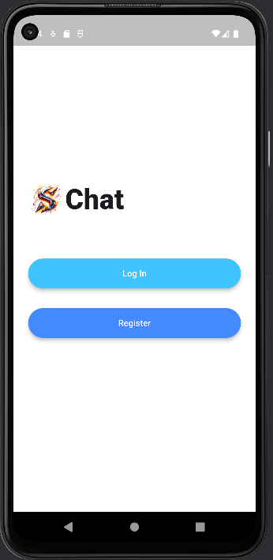
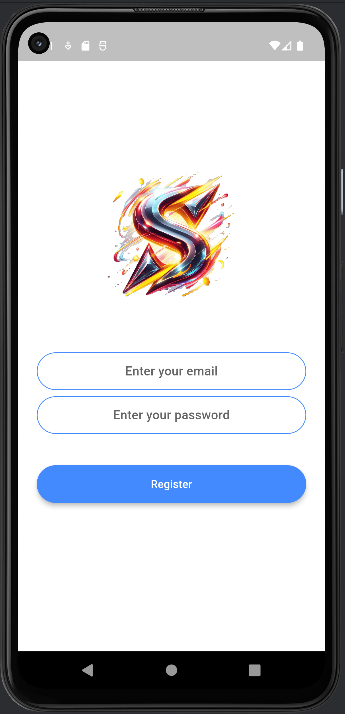
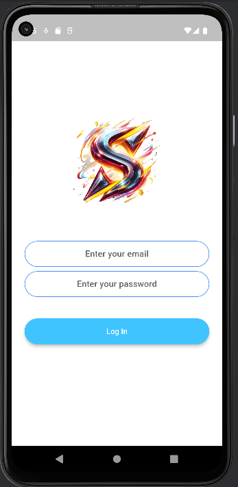
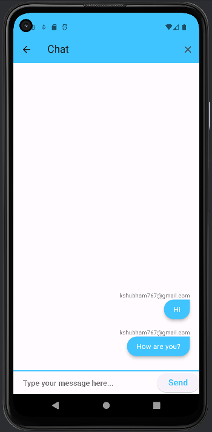

# SChat App

A Flutter-based chat application that allows users to communicate in real-time. The app utilizes Firebase for authentication and Firestore for storing chat messages.

## Features
- **Real-time Messaging:** Instantly send and receive messages in a chat interface.
- **User Authentication:** Secure user authentication powered by Firebase.
- **Responsive Design:** The app is designed to adapt to various screen sizes for a seamless user experience.

## Screenshots



*Caption: Welcome Screen - "A warm welcome to the Chat App. Get started by logging in or registering."*



*Caption: Registration Screen - "Create an account to start chatting. Enter your email and password to get started."*



*Caption: Login Screen - "Already have an account? Log in to join the conversation with your friends."*



*Caption: Chat Screen - "Engage in real-time conversations with friends. Messages are updated in real-time for a dynamic chatting experience."*

## Getting Started

To run this app locally, follow these steps:

1. Clone this repository:
   ```bash
   git clone https://github.com/kshubham767/SChat_App.git

2. Navigate to the project directory:
    ```bash
   cd SChat_App
3. Install dependencies:
   Make sure to check and update the dependencies in the pubspec.yaml file 
   ```bash
    flutter pub get

4. Run the app:
    ```bash
   flutter run

## Dependencies
This project uses the following Flutter packages:
- animated_text_kit: ^4.2.2: A package for adding beautiful and customizable text animations.
- firebase_core: ^2.24.2: The Firebase SDK for Flutter to initialize Firebase services in the app.
- firebase_auth: ^4.16.0: The Firebase authentication library for Flutter.
- cloud_firestore: ^4.14.0: The official Flutter plugin for Cloud Firestore, a NoSQL document database.
- modal_progress_hud_nsn: ^0.5.0: A package for showing a modal progress indicator (a loading spinner) while performing async operations.
  Make sure to check the official documentation or release notes for each package for any breaking changes or additional features introduced in newer versions.

## Contributing
If you'd like to contribute to the development of the SChat App, feel free to:

- Submit pull requests
- Open issues on the GitHub repository

## License
This project is licensed under the MIT License. See the [LICENSE](https://opensource.org/licenses/MIT) file for details.

## Contact
For any questions or feedback, please contact the project maintainer at kshubham767@gmail.com.
